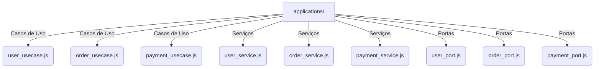

# Estrutura da Pasta `applications/`

A pasta `applications/` contém a lógica de aplicação da API, seguindo a Arquitetura Hexagonal para separar regras de negócio de infraestrutura e interfaces externas.

## Estrutura dos Arquivos

## Descrição dos Arquivos

### Casos de Uso (Application Layer)
- **`user_usecase.js`** → Contém a lógica de negócios para gerenciamento de usuários.
- **`order_usecase.js`** → Implementa regras para criação e gerenciamento de pedidos.
- **`payment_usecase.js`** → Gerencia a lógica de pagamento e transações.

### Serviços (Domain Layer)
- **`user_service.js`** → Implementa regras específicas e validações para usuários.
- **`order_service.js`** → Responsável pelo processamento e validação de pedidos.
- **`payment_service.js`** → Gerencia integração com provedores de pagamento.

### Portas (Interface Adapters Layer)
- **`user_port.js`** → Define contratos de comunicação para manipulação de usuários.
- **`order_port.js`** → Interface para requisições relacionadas a pedidos.
- **`payment_port.js`** → Define como a API lida com pagamentos e provedores externos.

