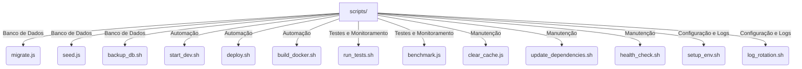

# Estrutura da Pasta `scripts/`

A pasta `scripts/` contém scripts auxiliares para automação de tarefas relacionadas ao desenvolvimento, implantação e manutenção da API.

## Estrutura dos Arquivos

## Descrição dos Arquivos

### Scripts de Banco de Dados
- **`migrate.js`** → Executa migrações do banco de dados usando Sequelize.
- **`seed.js`** → Popula o banco com dados iniciais (seeds).
- **`backup_db.sh`** → Faz backup do banco de dados automaticamente.

### Scripts de Automação
- **`start_dev.sh`** → Inicializa a API no modo de desenvolvimento.
- **`deploy.sh`** → Automatiza a implantação da API no servidor.
- **`build_docker.sh`** → Gera a imagem Docker para o projeto.

### Testes e Monitoramento
- **`run_tests.sh`** → Executa os testes unitários, integração e e2e.
- **`benchmark.js`** → Executa testes de desempenho usando `k6`.

### Scripts de Manutenção
- **`clear_cache.js`** → Limpa cache de dados armazenados em Redis ou outro serviço.
- **`update_dependencies.sh`** → Atualiza pacotes do `package.json`.
- **`health_check.sh`** → Verifica se os serviços essenciais da API estão rodando.

### Scripts de Configuração e Logs
- **`setup_env.sh`** → Cria arquivos `.env` iniciais com valores padrão.
- **`log_rotation.sh`** → Gerencia logs da aplicação para evitar sobrecarga no servidor.

