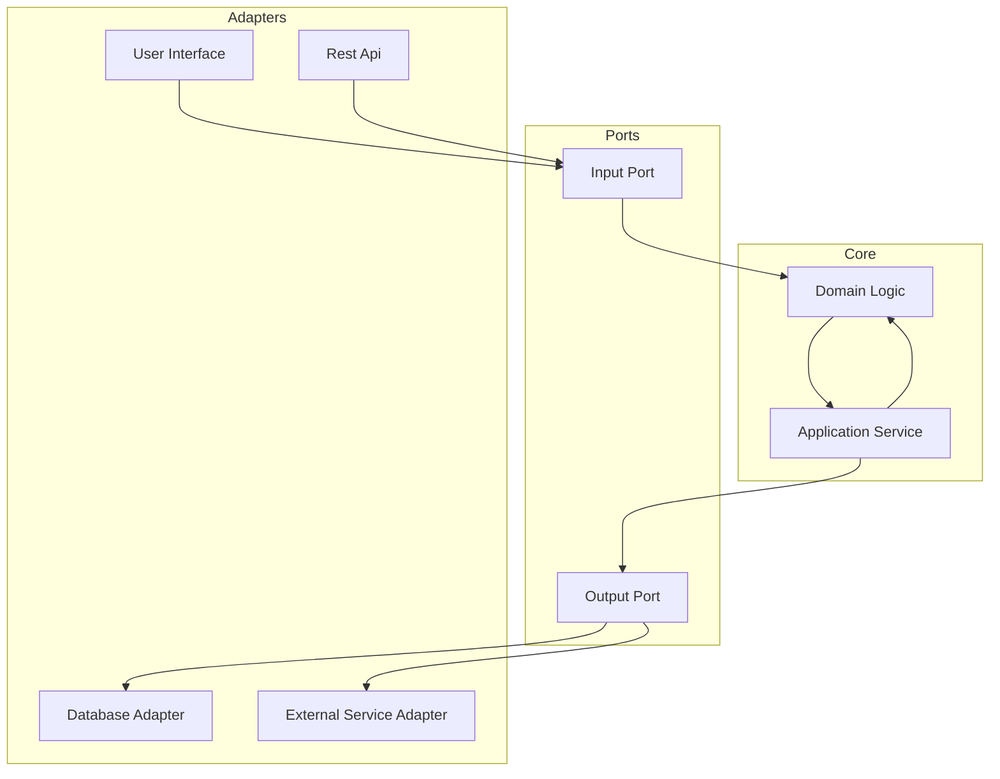
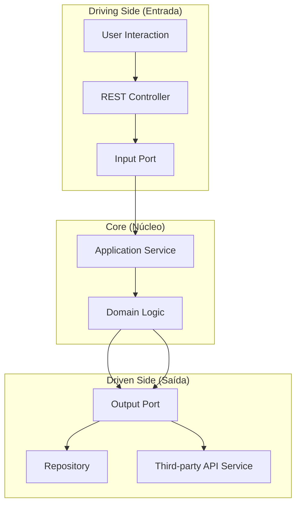
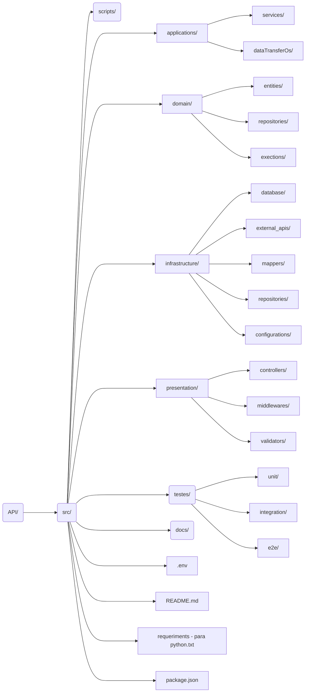
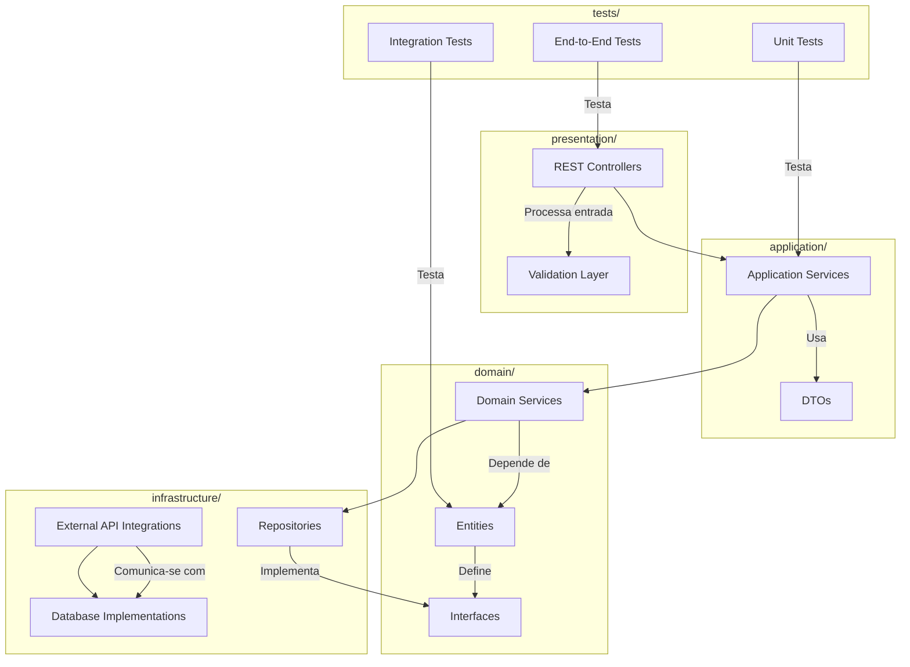

# API SMART EDU

Api desenvolvida para o sistema SMARTEDU, é um sistema para gerênciamento de recursos em humanos que abrange uma gama de soluções, desde o fornecimento de cursos para treinamentos ou mesmo para gerenciamente de recursos humanos.

## Funcionalidades Iniciais
* Criação de plataforma de cursos e treinamentos profissionais que possuem como finalidade:
    1. Treinar;
    2. Mapear;
    3. Selecionar;
    4. Recomendar;

## Tecnologia Utilizadas
* Backend:
    Node.js
* FrameWorks:
    1. express.js (api rest)
    2. k6.js    (Test)
    3. Sequilize (ORM)

## API Diagrama

Considerando a escabilidade e a necessidade de moduliação da aplicação, optamos pelo uso da api no modelo de **Arquitetura Hexagonal** (também como **Ports and Adaptares**) é um estilo de design que visa desacoplar os componentes centrais da aplicação(lógica de negócios) dos detalhes externos, como frameworks, banco de dados ou APIs externas. Isso facilita a testabilidade, manutenção e escalabilidade.

## **Core (Núcleo da Aplicação)**

| Elemento | O que faz | Responsabilidade |
|---------|----------|------------------|
| **Domain Logic** | Onde ficam as regras de negócio puras | Contém as entidades, agregados, validações, e lógicas que independem de framework ou tecnologia |
| **Application Service** | Orquestrador das ações | Controla o fluxo de execução da regra de negócio, interage com as portas de saída para buscar ou persistir dados |

## **Ports (Portas de Entrada e Saída)**

| Elemento | O que faz | Responsabilidade |
|---------|----------|------------------|
| **Input Port** | Contrato da entrada de dados | Interface que define os métodos que a aplicação aceita receber (ex: `create_user`, `get_orders`) |
| **Output Port** | Contrato para saída de dados | Interface que define as dependências externas que o Core precisa (ex: repositórios, serviços externos) |

---

## **Adapters (Adaptadores de Entrada e Saída)**

| Elemento | O que faz | Responsabilidade |
|---------|----------|------------------|
| **User Interface (UI)** | Camada de apresentação (web ou app) | Exibe informações para o usuário e captura dados (pode ser web, mobile, CLI) |
| **REST API** | Adapter de Entrada | Traduz requisições HTTP em chamadas para o **Input Port**. Ex: um `POST /users` vira `create_user(data)` |
| **Database Adapter** | Adapter de Saída | Implementa o contrato do OutputPort para interagir com o banco de dados |
| **External Service Adapter** | Adapter de Saída | Implementa o contrato do OutputPort para consumir APIs externas, filas, serviços de terceiros |

---
## Diagrama

## **Exemplo de Fluxo Completo**

1. Usuário faz um POST /users na REST API (Adapter de Entrada)
2. REST API chama o método do InputPort -> create_user()
3. Application Service orquestra a lógica
4. Regras de negócio (Domain Logic) são aplicadas
5. Se precisar salvar algo, Application Service chama o OutputPort
6. OutputPort chama o Database Adapter para persistir os dados
7. Resposta é devolvida pela REST API

### Estrutura da API
1. Driving Side (Entrada):

* User Interaction: Representa o ponto inicial das interações, como um cliente ou usuário.
* REST Controller: Traduz as requisições para chamadas nos ports de entrada.
* Input Port: Define a interface usada pelo núcleo para receber comandos.

2. Core (Núcleo):
* Application Service: Orquestra chamadas entre o domínio e os ports.
* Domain Logic: Contém as regras de negócios centrais.

3. Driven Side (Saída):
* Output Port: Interface para comunicação com sistemas externos.
* Database Adapter: Implementação do repositório.
* External API Adapter: Implementação de chamadas para serviços externos.

## Estrutura Organizacional da API.

### Descrição do Modelo
1. application/:
- Contém os serviços de aplicação que orquestram as operações de alto nível.
- Os DTOs garantem a separação entre as camadas.
2. domain/:
- O núcleo do sistema, com regras de negócios, entidades, e interfaces para persistência.
3. infrastructure/:
- Implementações de repositórios, integração com bancos de dados e APIs externas.
- Contém código dependente de frameworks e infraestrutura.
presentation/:

4. Responsável por interagir com o usuário ou cliente (controladores REST, validações de entrada).
5. tests/:
- Separado por tipo de teste para facilitar a manutenção e a rastreabilidade.

