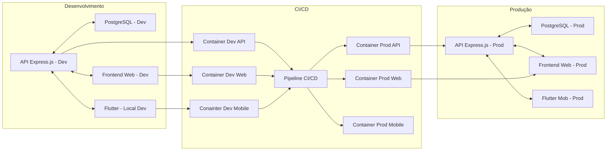

# ARQUITETURA SMARTEDU

#### Estrutura Geral Proposta:
- **API com Express.js**:
  - O backend será feito com Express.js e estará dividido em dois ambientes: **desenvolvimento** e **produção**, cada um em um container Docker separado.

- **Banco de Dados PostgreSQL**:
  - O banco de dados PostgreSQL será isolado em containers separados para cada ambiente (Desenvolvimento e Produção), garantindo isolamento de dados.

- **Flutter**:
  - O Flutter será desenvolvido no ambiente local, e os builds poderão ser enviados para containers de desenvolvimento e consequenemente de produção.

- **Frontend Web**:
  - O ambiente web terá dois containers:
    - **Desenvolvimento**: Container para o frontend web durante o desenvolvimento.
    - **Produção**: Container para o frontend web em produção.

### Vantagens da Abordagem:

1. **Isolamento dos Ambientes**:
   - Os ambientes de desenvolvimento, produção e Flutter são completamente separados, garantindo que mudanças em um não impactem diretamente nos outros.

2. **CI/CD Implementado**:
   - Com o CI/CD, cada commit ou merge no repositório pode automaticamente executar pipelines para testar, validar, e empacotar artefatos, mantendo o código em um estado funcional antes de ser enviado para produção.
   - O uso de containers para desenvolvimento e produção permite testes e builds consistentes antes de liberar para produção.

3. **Escalabilidade**:
   - Separar os ambientes de desenvolvimento e produção facilita a escalabilidade, tornando possível o crescimento separado de cada um sem afetar os outros.
   - O ambiente Flutter sendo desenvolvido localmente pode ser integrado ao CI/CD para testes de builds antes do deploy.

4. **Flexibilidade**:
   - A abordagem baseada em Docker permite configurar facilmente os ambientes locais e de produção para atender às necessidades específicas.

### Desafios a Considerar:
**DEVOPS**

1. **Complexidade de Manutenção**:
   - Ter múltiplos containers pode tornar a manutenção e o monitoramento mais complexos.
   - É essencial ter um sistema de logs e monitoramento para garantir que todos os containers estejam funcionando corretamente.

2. **Consistência no Desenvolvimento Flutter**:
   - O desenvolvimento Flutter local e o empacotamento para containers de produção precisam garantir a mesma qualidade e desempenho em ambos os ambientes. Pode haver desafios relacionados à dependência de bibliotecas, configurações de compilação, etc.

3. **Desempenho da API**:
   - Na produção, garantir que a API tenha alta performance e escalabilidade é fundamental. É necessário configurar bem os containers para evitar gargalos.

4. **Segurança**:
   - Implementar medidas de segurança para proteger tanto a API quanto os dados no banco é essencial, especialmente quando várias camadas (API, Flutter, web) interagem entre si.

### Diagrama De Arquitetura:

