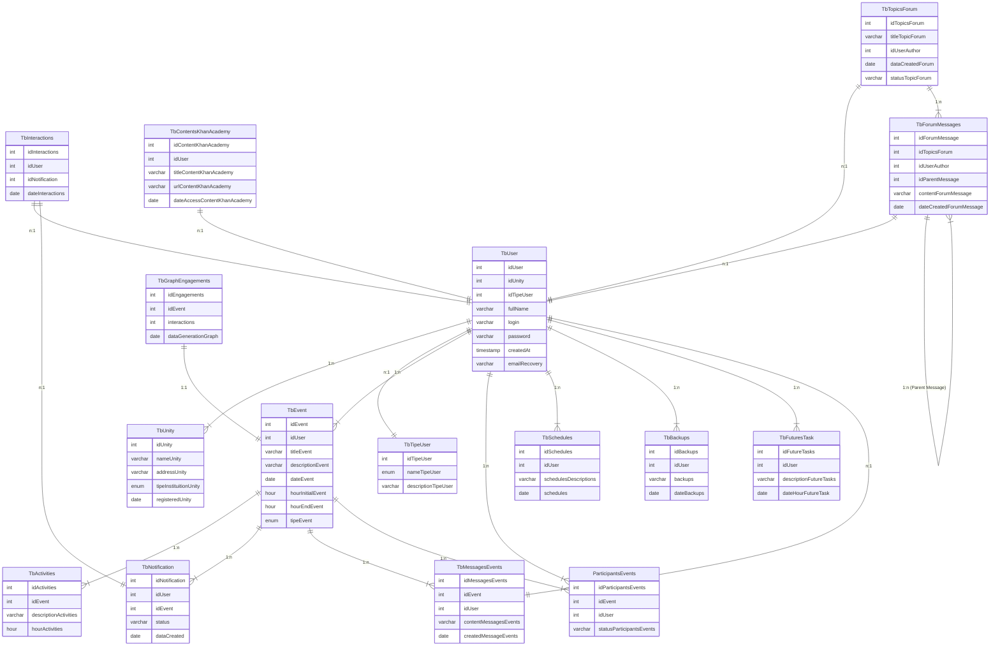
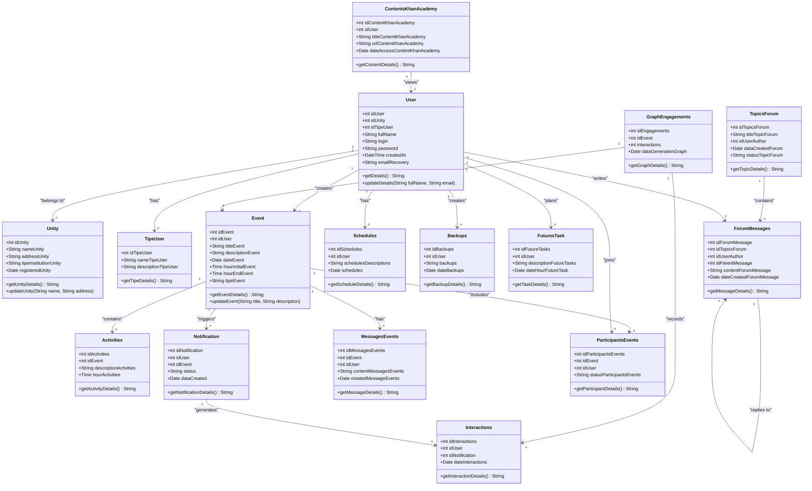
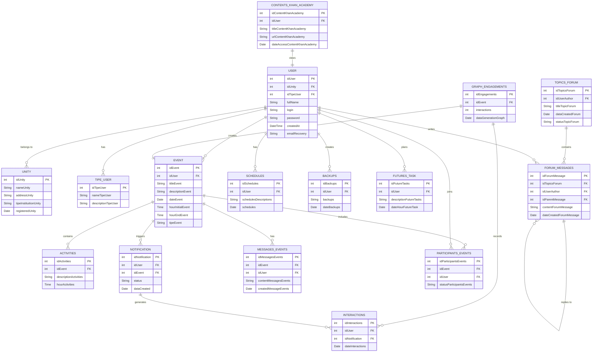

# Banco Dados Diagramas

## Diagrama de Entidade Relacionamento Modelo Conceitual

```mermaid
erDiagram
    TbUser {
        int idUser
        int idUnity
        int idTipeUser
        varchar fullName
        varchar login
        varchar password
        timestamp createdAt
        varchar emailRecovery
    }
    TbUnity {
        int idUnity
        varchar nameUnity
        varchar addressUnity
        enum tipeInstituitionUnity
        date registeredUnity
    }
    TbTipeUser {
        int idTipeUser
        enum nameTipeUser
        varchar descriptionTipeUser
    }
    TbEvent {
        int idEvent
        int idUser
        varchar titleEvent
        varchar descriptionEvent
        date dateEvent
        hour hourInitialEvent
        hour hourEndEvent
        enum tipeEvent
    }
    TbActivities {
        int idActivities
        int idEvent
        varchar descriptionActivities
        hour hourActivities
    }
    TbNotification {
        int idNotification
        int idUser
        int idEvent
        varchar status
        date dataCreated
    }
    TbMessagesEvents {
        int idMessagesEvents
        int idEvent
        int idUser
        varchar contentMessagesEvents
        date createdMessageEvents
    }
    ParticipantsEvents {
        int idParticipantsEvents
        int idEvent
        int idUser
        varchar statusParticipantsEvents
    }
    TbSchedules {
        int idSchedules
        int idUser
        varchar schedulesDescriptions
        date schedules
    }
    TbBackups {
        int idBackups
        int idUser
        varchar backups
        date dateBackups
    }
    TbGraphEngagements {
        int idEngagements
        int idEvent
        int interactions
        date dataGenerationGraph
    }
    TbFuturesTask {
        int idFutureTasks
        int idUser
        varchar descriptionFutureTasks
        date dateHourFutureTask
    }
    TbInteractions {
        int idInteractions
        int idUser
        int idNotification
        date dateInteractions
    }
    TbContentsKhanAcademy {
        int idContentKhanAcademy
        int idUser
        varchar titleContentKhanAcademy
        varchar urlContentKhanAcademy
        date dateAccessContentKhanAcademy
    }
    TbTopicsForum {
        int idTopicsForum
        varchar titleTopicForum
        int idUserAuthor
        date dataCreatedForum
        varchar statusTopicForum
    }
    TbForumMessages {
        int idForumMessage
        int idTopicsForum
        int idUserAuthor
        int idParentMessage
        varchar contentForumMessage
        date dateCreatedForumMessage
    }

    TbUser ||--|{ TbUnity : "1:n"
    TbUser ||--|| TbTipeUser : "n:1"
    TbUser ||--|{ TbEvent : "1:n"
    TbEvent ||--|{ TbActivities : "1:n"
    TbEvent ||--|{ TbNotification : "1:n"
    TbEvent ||--|{ TbMessagesEvents : "1:n"
    TbMessagesEvents ||--|| TbUser : "n:1"
    TbEvent ||--|{ ParticipantsEvents : "1:n"
    TbUser ||--|{ ParticipantsEvents : "1:n"
    TbUser ||--|{ TbSchedules : "1:n"
    TbUser ||--|{ TbBackups : "1:n"
    TbUser ||--|{ TbFuturesTask : "1:n"
    TbInteractions ||--|| TbUser : "n:1"
    TbInteractions ||--|| TbNotification : "n:1"
    TbGraphEngagements ||--|| TbEvent : "1:1"
    TbContentsKhanAcademy ||--|| TbUser : "n:1"
    TbTopicsForum ||--|| TbUser : "n:1"
    TbTopicsForum ||--|{ TbForumMessages : "1:n"
    TbForumMessages ||--|| TbUser : "n:1"
    TbForumMessages ||--|{ TbForumMessages : "1:n (Parent Message)"


```
## Diagrama de Classes

```mermaid
classDiagram
    class User {
        +int idUser
        +int idUnity
        +int idTipeUser
        +String fullName
        +String login
        +String password
        +DateTime createdAt
        +String emailRecovery
        +getDetails() String
        +updateDetails(String fullName, String email)
    }
    
    class Unity {
        +int idUnity
        +String nameUnity
        +String addressUnity
        +String tipeInstituitionUnity
        +Date registeredUnity
        +getUnityDetails() String
        +updateUnity(String name, String address)
    }
    
    class TipeUser {
        +int idTipeUser
        +String nameTipeUser
        +String descriptionTipeUser
        +getTipeDetails() String
    }
    
    class Event {
        +int idEvent
        +int idUser
        +String titleEvent
        +String descriptionEvent
        +Date dateEvent
        +Time hourInitialEvent
        +Time hourEndEvent
        +String tipeEvent
        +getEventDetails() String
        +updateEvent(String title, String description)
    }
    
    class Activities {
        +int idActivities
        +int idEvent
        +String descriptionActivities
        +Time hourActivities
        +getActivityDetails() String
    }
    
    class Notification {
        +int idNotification
        +int idUser
        +int idEvent
        +String status
        +Date dataCreated
        +getNotificationDetails() String
    }
    
    class MessagesEvents {
        +int idMessagesEvents
        +int idEvent
        +int idUser
        +String contentMessagesEvents
        +Date createdMessageEvents
        +getMessageDetails() String
    }
    
    class ParticipantsEvents {
        +int idParticipantsEvents
        +int idEvent
        +int idUser
        +String statusParticipantsEvents
        +getParticipantDetails() String
    }
    
    class Schedules {
        +int idSchedules
        +int idUser
        +String schedulesDescriptions
        +Date schedules
        +getScheduleDetails() String
    }
    
    class Backups {
        +int idBackups
        +int idUser
        +String backups
        +Date dateBackups
        +getBackupDetails() String
    }
    
    class GraphEngagements {
        +int idEngagements
        +int idEvent
        +int interactions
        +Date dataGenerationGraph
        +getGraphDetails() String
    }
    
    class FuturesTask {
        +int idFutureTasks
        +int idUser
        +String descriptionFutureTasks
        +Date dateHourFutureTask
        +getTaskDetails() String
    }
    
    class Interactions {
        +int idInteractions
        +int idUser
        +int idNotification
        +Date dateInteractions
        +getInteractionDetails() String
    }
    
    class ContentsKhanAcademy {
        +int idContentKhanAcademy
        +int idUser
        +String titleContentKhanAcademy
        +String urlContentKhanAcademy
        +Date dateAccessContentKhanAcademy
        +getContentDetails() String
    }
    
    class TopicsForum {
        +int idTopicsForum
        +String titleTopicForum
        +int idUserAuthor
        +Date dataCreatedForum
        +String statusTopicForum
        +getTopicDetails() String
    }
    
    class ForumMessages {
        +int idForumMessage
        +int idTopicsForum
        +int idUserAuthor
        +int idParentMessage
        +String contentForumMessage
        +Date dateCreatedForumMessage
        +getMessageDetails() String
    }

    %% Relationships
    User "1" --> "n" Unity : "belongs to"
    User "1" --> "n" TipeUser : "has"
    User "1" --> "n" Event : "creates"
    Event "1" --> "n" Activities : "contains"
    Event "1" --> "n" Notification : "triggers"
    Event "1" --> "n" MessagesEvents : "has"
    Event "1" --> "n" ParticipantsEvents : "includes"
    User "1" --> "n" ParticipantsEvents : "joins"
    User "1" --> "n" Schedules : "has"
    User "1" --> "n" Backups : "creates"
    GraphEngagements "1" --> "1" Event : "tracks"
    GraphEngagements "1" --> "n" Interactions : "records"
    User "1" --> "n" FuturesTask : "plans"
    Notification "1" --> "n" Interactions : "generates"
    ContentsKhanAcademy "n" --> "1" User : "views"
    TopicsForum "1" --> "n" ForumMessages : "contains"
    ForumMessages "1" --> "n" ForumMessages : "replies to"
    User "1" --> "n" ForumMessages : "writes"

```

## Diagrama de Estrutura de dados

```mermaid
erDiagram
    USER {
        int idUser PK
        int idUnity FK
        int idTipeUser FK
        String fullName
        String login
        String password
        DateTime createdAt
        String emailRecovery
    }
    
    UNITY {
        int idUnity PK
        String nameUnity
        String addressUnity
        String tipeInstituitionUnity
        Date registeredUnity
    }
    
    TIPE_USER {
        int idTipeUser PK
        String nameTipeUser
        String descriptionTipeUser
    }
    
    EVENT {
        int idEvent PK
        int idUser FK
        String titleEvent
        String descriptionEvent
        Date dateEvent
        Time hourInitialEvent
        Time hourEndEvent
        String tipeEvent
    }
    
    ACTIVITIES {
        int idActivities PK
        int idEvent FK
        String descriptionActivities
        Time hourActivities
    }
    
    NOTIFICATION {
        int idNotification PK
        int idUser FK
        int idEvent FK
        String status
        Date dataCreated
    }
    
    MESSAGES_EVENTS {
        int idMessagesEvents PK
        int idEvent FK
        int idUser FK
        String contentMessagesEvents
        Date createdMessageEvents
    }
    
    PARTICIPANTS_EVENTS {
        int idParticipantsEvents PK
        int idEvent FK
        int idUser FK
        String statusParticipantsEvents
    }
    
    SCHEDULES {
        int idSchedules PK
        int idUser FK
        String schedulesDescriptions
        Date schedules
    }
    
    BACKUPS {
        int idBackups PK
        int idUser FK
        String backups
        Date dateBackups
    }
    
    GRAPH_ENGAGEMENTS {
        int idEngagements PK
        int idEvent FK
        int interactions
        Date dataGenerationGraph
    }
    
    FUTURES_TASK {
        int idFutureTasks PK
        int idUser FK
        String descriptionFutureTasks
        Date dateHourFutureTask
    }
    
    INTERACTIONS {
        int idInteractions PK
        int idUser FK
        int idNotification FK
        Date dateInteractions
    }
    
    CONTENTS_KHAN_ACADEMY {
        int idContentKhanAcademy PK
        int idUser FK
        String titleContentKhanAcademy
        String urlContentKhanAcademy
        Date dateAccessContentKhanAcademy
    }
    
    TOPICS_FORUM {
        int idTopicsForum PK
        int idUserAuthor FK
        String titleTopicForum
        Date dataCreatedForum
        String statusTopicForum
    }
    
    FORUM_MESSAGES {
        int idForumMessage PK
        int idTopicsForum FK
        int idUserAuthor FK
        int idParentMessage FK
        String contentForumMessage
        Date dateCreatedForumMessage
    }

    %% Relationships
    USER ||--o{ UNITY : "belongs to"
    USER ||--o{ TIPE_USER : "has"
    USER ||--o{ EVENT : "creates"
    EVENT ||--o{ ACTIVITIES : "contains"
    EVENT ||--o{ NOTIFICATION : "triggers"
    EVENT ||--o{ MESSAGES_EVENTS : "has"
    EVENT ||--o{ PARTICIPANTS_EVENTS : "includes"
    USER ||--o{ PARTICIPANTS_EVENTS : "joins"
    USER ||--o{ SCHEDULES : "has"
    USER ||--o{ BACKUPS : "creates"
    GRAPH_ENGAGEMENTS ||--|| EVENT : "tracks"
    GRAPH_ENGAGEMENTS ||--o{ INTERACTIONS : "records"
    USER ||--o{ FUTURES_TASK : "plans"
    NOTIFICATION ||--o{ INTERACTIONS : "generates"
    CONTENTS_KHAN_ACADEMY ||--|| USER : "views"
    TOPICS_FORUM ||--o{ FORUM_MESSAGES : "contains"
    FORUM_MESSAGES ||--o{ FORUM_MESSAGES : "replies to"
    USER ||--o{ FORUM_MESSAGES : "writes"

```
## Arquitetura do Banco de Dados
e