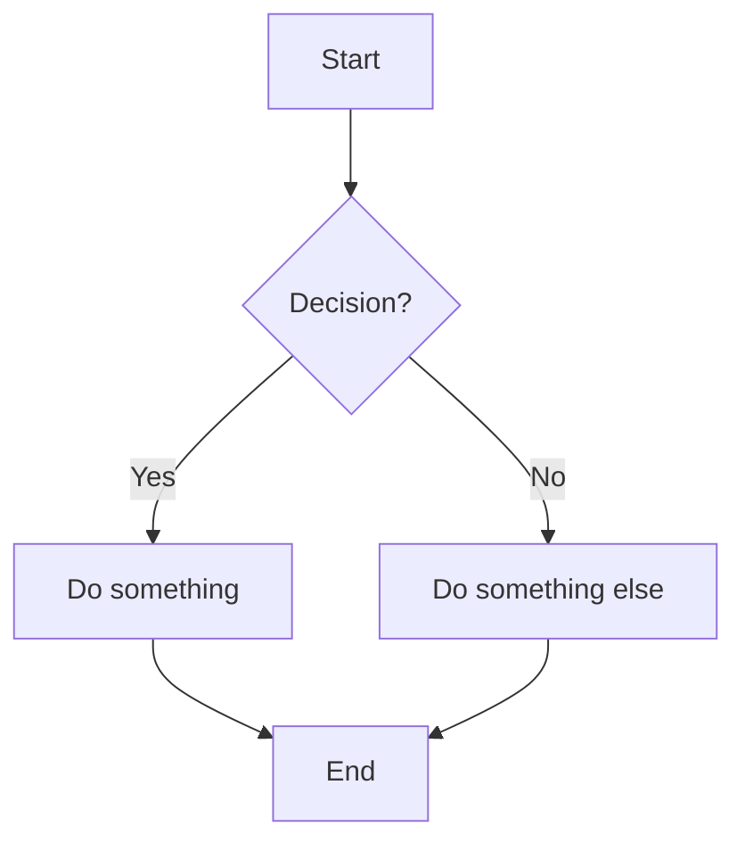

# Banco Dados Diagramas


## Diagrama de Entidade Relacionamento Modelo Conceitual



## Diagrama Entidade Relacionamento Modelo Lógico

## Diagrama de Fluxo
## Diagrama de Classes


## Diagrama de Estrutura de dados

## Arquitetura do Banco de Dados


```mermaid
flowchart TB
    A[]
```